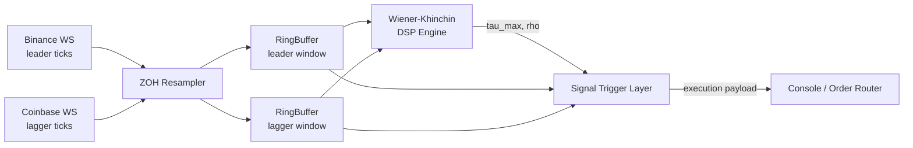

# Real-Time Lead-Lag Arbitrage Engine

Detects the time lag between two correlated exchange price feeds (e.g. Binance vs. Coinbase BTC-USD) using FFT-based cross-correlation, and fires fee-aware execution signals when the leading exchange's momentum is expected to propagate to the lagging one.



## How it works

1. **`zoh_resampler.py`** pulls asynchronous ticks from both venues onto a common uniform time grid (default `Δt = 5ms`) via zero-order hold.
2. **`ring_buffer.py`** holds a rolling window of the last `N` resampled prices per venue.
3. **`dsp_engine.py`** computes the cross-correlation between the two windows via FFT, returning the detected lag `τ_max` and a confidence score `ρ`.
4. **`trigger_layer.py`** gates on lag direction, confidence, and whether the leader's recent price velocity clears round-trip transaction costs, then emits an execution payload.
5. **`live_streamer.py`** runs this loop live against Binance/Coinbase websockets. **`backtester.py`** replays historical tick data through the same pipeline with simulated fill latency, and reports Sharpe ratio, drawdown, win rate, and the distribution of detected lags.

## The Math: FFT & Wiener–Khinchin

Cross-correlation at lag `τ` is defined as:

$$R_{xy}(\tau) = \sum_{t} x[t]\, y[t+\tau]$$

Computing this directly for every candidate lag is `O(n²)`. The **Wiener–Khinchin theorem** avoids that by stating that cross-correlation and cross-power spectral density are a Fourier transform pair:

$$R_{xy}(\tau) = \mathcal{F}^{-1}\left\{ \overline{X(f)} \cdot Y(f) \right\}$$

where `X(f) = FFT(x)`, `Y(f) = FFT(y)`, and the bar denotes complex conjugate. Two forward FFTs, one elementwise multiply, one inverse FFT — every lag recovered at once in `O(n log n)`.

**Pipeline in `dsp_engine.py`:**

| Step | Purpose |
|---|---|
| `np.diff` + de-mean | Correlate returns, not price levels — levels are non-stationary and produce spurious correlation regardless of true lag. |
| Hann window | Tapers buffer edges to reduce spectral leakage from the FFT treating a finite chunk as periodic. |
| Zero-pad to `2n-1` | Linearizes the correlation so it reflects true finite overlap instead of circular wraparound. |
| `conj(X) * Y` → IFFT | The cross-power spectral density, inverse-transformed back to the full lag-correlation curve. |
| `fftshift` | Centers zero-lag in the array for indexing. |
| `± max_lag_buckets` | Clamps the search to a physically plausible lag range (±500ms default). |
| `ρ = R_xy(τ*) / sqrt(Σx² · Σy²)` | Normalized confidence at the detected peak, bounded in `[0, 1]`. |

`x` is the leader, `y` is the lagger. A positive `τ_max` means the leader is currently `τ_max` ahead of the lagger.

## Quickstart

```bash
pip install numpy websockets matplotlib

# Live mode
python -m src.live_streamer

# Backtest: JSON tick files as [{ "timestamp": epoch_seconds, "price": float }, ...]
python -m src.backtester leader_ticks.json lagger_ticks.json
```

```python
from src.backtester import LatencyAwareBacktester

bt = LatencyAwareBacktester(latency_ms=30.0, taker_fee_rate=0.0005)
results = bt.run(leader_ticks, lagger_ticks)
print(results["sharpe_ratio"], results["total_return_pct"])
```

## Requirements

- Python 3.9+
- `numpy`
- `websockets` (live streaming)
- `matplotlib` (backtester histogram plot)
